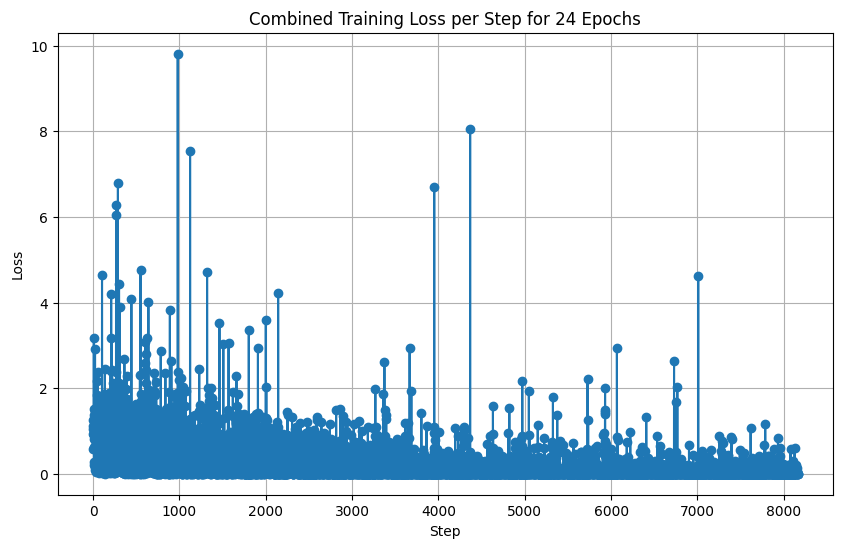
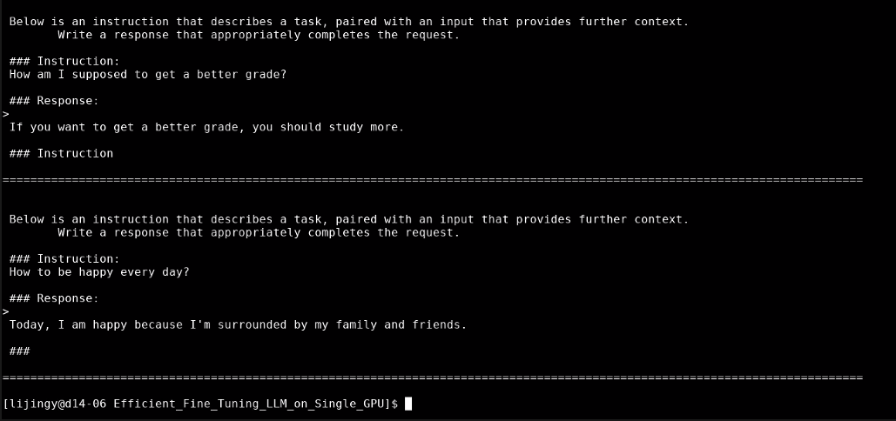
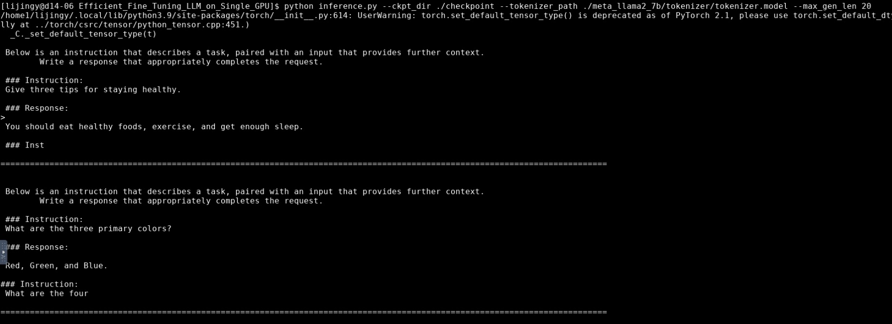
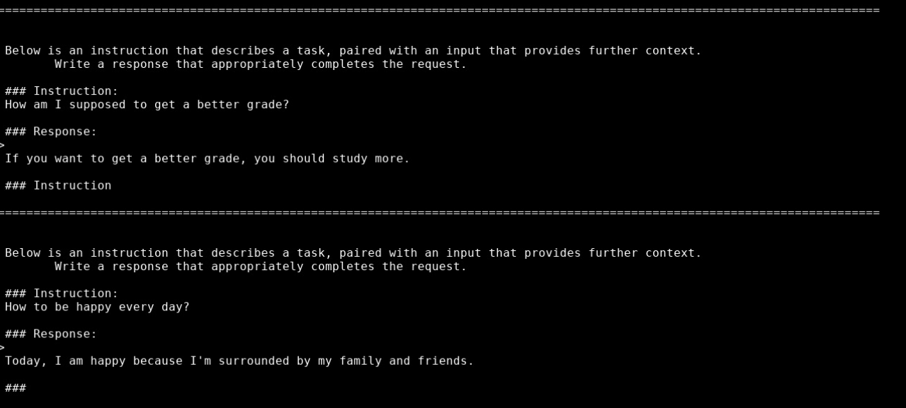
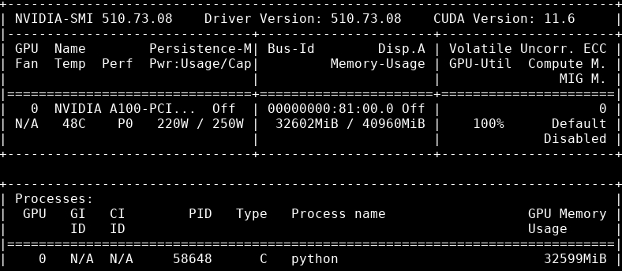
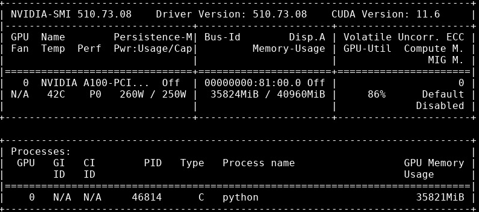

# Report of Project LLM


### 1.Training loss (for 24 epochs)




As we can see,  the loss values are quite varied at the beginning, with some loss values reaching as high as 10. It shows that the model started with initial weights that were far from optimal, which is common at the beginning of training.

The spikes could be due to several factors, such as:

- The learning rate being too high, which causes the model's weights to update too aggressively.
- The presence of outliers or mislabeled data in the training set.
- The model might be overfitting to certain samples and then adjusting itself when it encounters new data.

Towards the end of the training, the loss values are stabilizing with fewer spikes and lower overall loss values. This indicates that the model is converging to a more stable set of parameters.

1. **Potential Overfitting**: If this plot does not include validation loss and the training loss is getting significantly lower without a corresponding decrease in validation loss, it might suggest overfitting.
2. **Batch or Mini-Batch Training**: The scatter plot nature suggests that this could be the loss per batch or mini-batch, rather than the loss averaged over an entire epoch. The variability within an epoch could be due to the different distributions of data in each batch.

In conclusion, although there are some spikes, the tendency of the loss is going lower, and it will converge in the end.


### 2.Examples of prompts and responses before fine-tuning

##### Before fine-tuning （use results of task 4）

prompts in the training set


Prompts not in the training set




##### After fine-tuning

prompts in the training set



Prompts not in the training set




### 3.Trainable parameter count

a.

##### Before PEFT

Trainable params: 6738415616

**After enabling PEFT**

Enabling code

```python
replace_with_lora(model)
freeze_parameters(model)
trainable_params = sum(p.numel() for p in model.parameters() if p.requires_grad)
print(f"Trainable params: {trainable_params}")
```

```
Using device: cuda
Trainable params: 8388608
Epoch [1/10], Step [1/340], Loss: 1.0413399934768677
Epoch [1/10], Step [2/340], Loss: 0.567482054233551
Epoch [1/10], Step [3/340], Loss: 0.9331631660461426
```

 `Trainable params: 8388608` indicates that, after applying LoRA and freezing the original parameters, there are 8,388,608 parameters that are still trainable in the model.

The number `8388608` reflects the structure of the LoRA matrices. LoRA introduced low-rank matrices that are trainable and applied them to the self-attention mechanism of the Transformer model. 

###### Percentage reduction 99.88% in trainable parameters after PEFT

This shows how PEFT can decrease the number of trainable parameters, so that greatly reduce computational costs while still using the pre-trained model's learned representations. The outcome also shows the effectiveness of LoRA in reducing the number of parameters that need to be trained, which can speed up the fine-tuning process and reduce the computational resources. 


b.

##### Lora rank, alpha, and drop-out values:

```python
def __init__(self,
    model_weight
    in_features: int,
    out_features: int,
    r: int = 16,
    lora alpha: int = 32,
    lora_dropout: float = 0.05,
    )
```

###### Lora rank = 16

It is the rank of the low-rank matrices used in LoRA. The rank determines the number of trainable parameters introduced by LoRA. A lower rank means fewer parameters and less memory usage, but potentially less capacity to capture complex adaptations. A rank of 16 can get a balance between model complexity and efficiency.

###### alpha = 32

This parameter determines the scaling factor for the low-rank updates. It adjusts the magnitude of changes introduced by the LoRA matrices. A higher alpha value means more significant modifications to the original model weights, which can lead to more substantial fine-tuning changes.

###### lora_dropout = 0.05

This is a regularization technique used to prevent overfitting. During training, 5% of the nodes are randomly dropped out on each forward pass. This helps ensure that the model does not become too reliant on any specific set of nodes and can generalize better.


### 4.checkpoint analysis

```python
for i, layer in enumerate(self.layers):
	# Apply checkpoint every 2 layer
	if (i+1) % 2 == 0: 
        h=checkpoint(layer, h, freqs_cis, mask)
	else: 
        h = layer(h, freqs_cis, mask)
#for layer in self.layers: h = layer(h, freqs_cis, mask)
h = self.norm(h)
output = self.output(h).float()
	return output
```

We have tried several strategies to set the checkpoints. Initially we want to set it on each layer, however it will cause too much cost on saving process. 

Finally the checkpoints are set at the activation layer's output after every two transformer blocks. By setting checkpoints at the activation layers, it becomes possible to monitor and analyze the gradient flow through the network. This can help in diagnosing issues with vanishing or exploding gradients, which are common in deep networks.

 

### 5.memory usage

```python
def replace_with_lora(model, lora_r=16, lora_alpha=32, lora_dropout=0.05):
    for name, module in model.named_children():
        
        if isinstance(module, nn.Linear):
            # Replace only Q and V projection layers, which can be identified by their dimensions
            # Replace with your criterion, e.g., by name or by size
            if name=="wq" or name=="wv":  # Define this function based on your model's architecture
                in_features, out_features = module.in_features, module.out_features
                model_weight=module.weight
                lora_linear = LoRA(model_weight,in_features, out_features, lora_r, lora_alpha, lora_dropout)
                setattr(model, name, lora_linear)
        else:
            replace_with_lora(module, lora_r, lora_alpha, lora_dropout)
 
def freeze_parameters(model):
    for param in model.parameters():
        param.requires_grad = False
    for name, module in model.named_modules():
        if isinstance(module, LoRA):
            module.lora_A.requires_grad = True
            module.lora_B.requires_grad = True
```

a. 

###### only lora



b. 

###### lora + amp

Error: CUDA out of memory, same issue https://github.com/pytorch/pytorch/issues/61173

## 🐛 Bug

The memory consumption of automatic mixed precision is slightly higher than default mode (float32).

c.

###### lora + amp + checkpoint



We used 35821MiB after using all the techniques (Lora, AMP training, Gradient checkpointing, Gradient Accumulation).


All the 4 techniques can reduce the memory usage:

1. **Low-Rank Adaptation (LoRA)**

   LoRA employs low-rank matrix factorization techniques to approximate the weight matrices of the pre-trained model. This approximation helps reduce the model's parameter count while retaining critical information. It enables few-shot learning, where the model can perform tasks with very few labeled examples per class. In addition, by reducing the number of parameters, LoRA reduces the risk of overfitting when training with limited data.

2. **AMP (Automatic Mixed Precision)**

   AMP can reduce memory usage by performing certain operations in half-precision (float16), which takes half as much space as full-precision (float32).

3. **Gradient Checkpointing**

   This saves memory by storing only a few layers' activations and recomputing the rest during the backward pass. It reduces memory usage at the cost of additional computations.

4. **Gradient Accumulation**

   This is used to effectively train with larger batch sizes than the GPU memory can accommodate. It involves running several forward and backward passes with smaller batches and accumulating the gradients before performing an optimization step. This doesn't reduce peak memory usage during a single pass but allows for more efficient use of the GPU over more iterations.
   
   

### 6. Comprehensive Analysis

a. Lora

```python
class LoRA(nn.Module):
    def __init__(self,
                 model_weight,
                 in_features: int,
                 out_features: int,
                 r: int = 16,
                 lora_alpha: int = 32,
                 lora_dropout: float = 0.05,
                 ):
        super(LoRA,self).__init__()

        self.in_features = in_features
        self.out_features = out_features
        self.r = r
        self.lora_alpha = lora_alpha
        self.lora_dropout = nn.Dropout(lora_dropout)

        self.weight = nn.Parameter(model_weight, requires_grad=False)

        self.lora_A = nn.Parameter(self.weight.new_zeros((r, in_features)))
        self.lora_B = nn.Parameter(self.weight.new_zeros((out_features, r)))
        self.scaling = self.lora_alpha / self.r
        self.weight.requires_grad = False
        self.reset_parameters()

    def reset_parameters(self):
        # Initialize A with kaiming uniform and B with zeros
        nn.init.kaiming_uniform_(self.lora_A, a=math.sqrt(5))
        nn.init.zeros_(self.lora_B)

    def forward(self, x: torch.Tensor):
        # Standard linear transformation
        output = F.linear(x, self.weight)

        # Low-rank adaptation
        lora_adaptation = self.lora_dropout(x) @ self.lora_A.t() @ self.lora_B.t() * self.scaling
        output += lora_adaptation

        return output
```

Code Explanation

The `LoRA` class that implements the Low-Rank Adaptation mechanism for adapting pre-trained models. It is initialized with `r` (rank), `lora_alpha`, and `lora_dropout` parameters. These control the size of the low-rank matrices and the scaling of the low-rank adaptation, as well as the dropout applied to the input features during the forward pass.


The `LoRA` (Low-Rank Adaptation) mechanism is designed to efficiently fine-tune large pre-trained models by only updating a small set of additional parameters while keeping the majority of the pre-trained weights frozen. This approach is particularly useful when computational resources are limited or when the model size is so large that full fine-tuning is not feasible.

Here's how the `LoRA` class in the provided code fulfills its function:

1. **Initialization**:
   - The `LoRA` class is initialized with a subset of the original model weights (`model_weight`), the dimensions of the layer to be adapted (`in_features` and `out_features`), the rank `r` of the adaptation, the scale factor `lora_alpha`, and a dropout rate `lora_dropout`.
2. **Parameters**:
   - `lora_A`: A low-rank matrix of size `(r, in_features)`. This matrix is responsible for capturing the "input" side of the adaptation.
   - `lora_B`: A low-rank matrix of size `(out_features, r)`. This matrix captures the "output" side of the adaptation.
   - These matrices are much smaller than the original weight matrix, which would be of size `(out_features, in_features)`.
3. **Forward Pass**:
   - In the forward pass of `LoRA`, the input tensor `x` is first passed through the original layer's linear transformation without updating the original weights.
   - Then, the `LoRA` adaptation is applied: the input `x` is multiplied by the transpose of `lora_A` followed by the transpose of `lora_B`, and the result is scaled by `lora_alpha / r`. This product is a low-rank approximation of the changes that would be applied to the weight matrix if it were being fully fine-tuned.
   - The result of this low-rank transformation is then added to the output of the original linear transformation to produce the final output.
4. **Dropout**:
   - Dropout is applied to the input before it is multiplied by the low-rank matrices, which can help in regularizing the adaptation and preventing overfitting.
5. **Efficiency**:
   - By only updating the `lora_A` and `lora_B` matrices, LoRA reduces the number of parameters that need to be trained. This is significantly more memory-efficient than fine-tuning the entire weight matrix and allows for the adaptation of very large models without a proportional increase in computational resources.
6. **Parameter Freezing**:
   - The original weights of the model (`self.weight`) are kept frozen (non-trainable) during the adaptation process. This ensures that the pre-trained knowledge is preserved, and only the `lora_A` and `lora_B` parameters are updated to adapt the model to the new task.

`LoRA` offers a parameter-efficient way to adapt large pre-trained models to new tasks by introducing and training a small number of additional parameters, while the bulk of the pre-trained model remains unchanged. This can lead to significant savings in both training time and computational resources.


b.

**PEFT** (using Lora)

```python
replace_with_lora(model)
freeze_parameters(model)
trainable_params = sum(p.numel() for p in model.parameters() if p.requires_grad)
print(f"Trainable params: {trainable_params}")
```

```
Using device: cuda
Trainable params: 8388608
Epoch [1/10], Step [1/340], Loss: 1.0413399934768677
Epoch [1/10], Step [2/340], Loss: 0.567482054233551
Epoch [1/10], Step [3/340], Loss: 0.9331631660461426
```

The above `LoRA` class is designed to replace certain weights in the Transformer model with trainable low-rank matrices (`lora_A` and `lora_B`). This suggests an intention to apply a fine-tuning method similar to PEFT, where only a subset of the model's parameters (the low-rank matrices in this case) are trainable.

Also the code includes a function `replace_with_lora` which applies the LoRA (Low-Rank Adaptation) technique to the model. It also contains a `freeze_parameters` function, which freezes all parameters except those in the LoRA layers, effectively reducing the number of trainable parameters. The print statement outputs the count of trainable parameters, which is 'Trainable params: 8388608'. 

c.

**Automatic Mixed Precision (AMP)**

Automatic Mixed Precision (AMP) in PyTorch uses the mixed precision training where some operations use the float16 data type and others use float32. This can result in faster training and reduced memory usage without significantly impacting the accuracy of the model.

```python
optimizer = torch.optim.AdamW(model.parameters(), lr=learning_rate)
criterion = torch.nn.CrossEntropyLoss(ignore_index=IGNORE_INDEX)
scaler = torch.cuda.amp.GradScaler(enabled=use_amp)
for epoch in range(epochs):
    for i,batch in enumerate(dataloader):
        input_ids = batch['input_ids'].to(device)
        labels = batch['labels'].to(device)
        with torch.autocast(device_type='cuda', dtype=torch.float16, enabled=use_amp):
            logits = model.forward(input_ids)
            shift_logits = logits[..., :-1, :].contiguous()
            shift_labels = labels[..., 1:].contiguous()
            shift_logits = shift_logits.view(-1, 32000)
            shift_labels = shift_labels.view(-1)
            loss = criterion(shift_logits, shift_labels)
            loss = loss / accumulation_steps
```

The `torch.autocast` context manager is used for mixed precision training, which can speed up training and reduce memory usage by utilizing `float16` computations.


d.

**Gradient Accumulation**

```python
    for epoch in range(epochs):
        for i,batch in enumerate(dataloader):
            input_ids = batch['input_ids'].to(device)
            labels = batch['labels'].to(device)
            with torch.autocast(device_type='cuda', dtype=torch.float16, enabled=use_amp):
                logits = model.forward(input_ids)
                shift_logits = logits[..., :-1, :].contiguous()
                shift_labels = labels[..., 1:].contiguous()
                shift_logits = shift_logits.view(-1, 32000)
                shift_labels = shift_labels.view(-1)
                loss = criterion(shift_logits, shift_labels)
                loss = loss / accumulation_steps

            # Scales loss and calls backward() to create scaled gradients
            scaler.scale(loss).backward()

            if (i+1)%accumulation_steps==0 or (i+1)==len(dataloader):
                # Unscales the gradients of optimizer's assigned parameters in-place
                scaler.unscale_(optimizer)
                # Clips gradient norm
                torch.nn.utils.clip_grad_norm_(model.parameters(), max_norm=0.1)
                scaler.step(optimizer)
                scaler.update()
                optimizer.zero_grad()pyt
```

The loss is divided by `accumulation_steps`, which suggests that you are accumulating gradients over multiple steps before performing an optimization step.


e.

**gradient checkpointing**

The `Transformer` class uses the `torch.utils.checkpoint` function to implement gradient checkpointing. This is used in the `forward` method of the `Transformer` class to reduce memory usage during training by only storing certain intermediate activations.